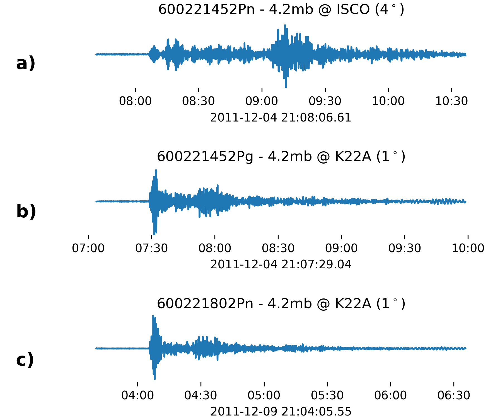
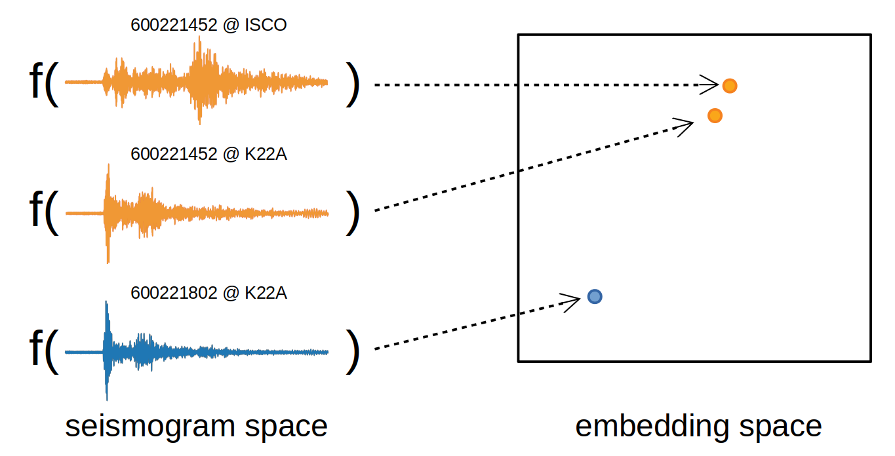
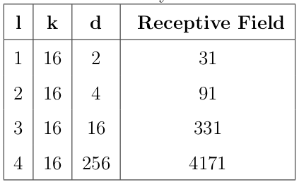
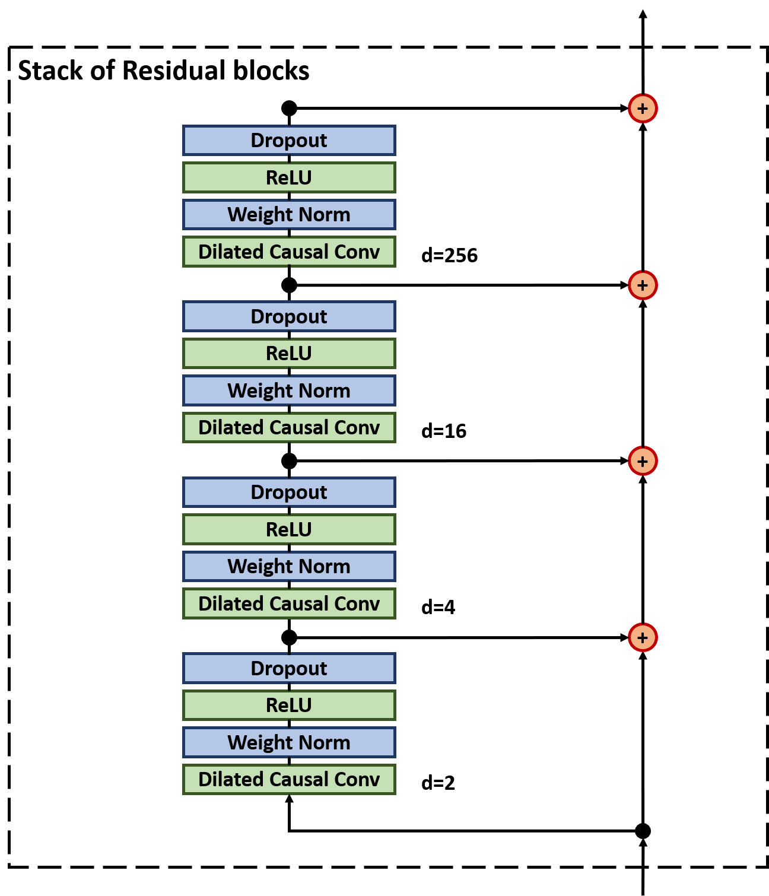

# SEISMOGRAM SIMILARITY

---

This repository presents a novel seismogram similarity measure that is explicitly invariant to path. The work is based on the paper _"Beyond Correlation: A Path-Invariant Measure for Seismogram Similarity"_ by Joshua Dickey, Brett Borghetti, William Junek and Richard Martin, which can be viewed in full on the ArXiv: https://arxiv.org/pdf/1904.07936.pdf.

This repository contains three parts:

1) __SeisSim.ipynb__ - This Jupyter Notebook explores the application of our trained similarity model to the test set. To run this notebook, simply clone this directory onto your machine. No GPU is required.

2) __Downloader.py__ - This program will download both the catalogs and waveforms necesssary to train and test a seismic similarity model. The catalogs are downloaded through a web query of the International Seismological Centre (ISC) Bulletin for seismic arrivals: http://www.isc.ac.uk/iscbulletin/search/arrivals/; and the waveforms are downloaded from the Incorporated Research Institutions for Seismology (IRIS) Database using ObsPy. This process may take several days, even with a fast internet connection.

3) __Trainer.py__ - This program will train a similarity model and save it to disk. It is suggested to have at least a TitanV GPU and 64GB of System RAM.

---
### BACKGROUND

#### Path-Dominant Similarity:

Similarity search is a popular technique for seismic signal processing, including both signal detection and source discrimination. Traditionally, these techniques rely on the cross-correlation function as the basis for measuring similarity. Unfortunately, seismogram correlation is dominated by path effects, as shown in the figure below:

The figure shows three Seismograms, each depicting an explosion at a coal mine near Thunder Basin, WY. Seismograms a) and b) depict a common source event (600221452), recorded at two separate seismic stations, ISCO and K22A respectively. Seismogram c) depicts a nearby event (600221802), also recorded at K22A. The correlation and visual similarity between the path-similar waveforms b) and c) is obvious. This path-dominant similarity can be desirable when detecting aftershock sequences from a particular fault, or mining blasts from within a small quarry. For general detection and discrimination, however, path-dominant similarity is problematic, as path differences of even just a quarter wavelength can significantly degrade the correlation of two seismograms.

#### Path-Invariant Similarity:

We now envision a new measure of seismogram similarity, that is path-independant. The notional diagram below illustrates an embedding function, f(.), which is a non-linear transformation that maps time-series seismograms to low-dimensional embeddings. The mappings are desired to be path-invariant and source-specific, such that regardless of the recording station, all seismograms associated with a particular event are mapped closely in the embedding space, and seismograms not associated with that event have more distant embeddings. We propose to learn such an embedding function explicitly, using a specialized convolutional neural network architecture, called a triplet network.

The Triplet Network is trained on batches of $m$ triples, where each triple is comprised of an anchor object, X_A^(i), a positive object, X_P^(i), and a negative object, X_N^(i). The triplet loss function computes the relative embedding distance between the matched pair and non-matched pair, and loss is accrued whenever the matched pair distance is not smaller than the non-matched distance by some margin.

To learn path-invariant embeddings, we simply pick our triples such that the anchor and positive objects are seismograms sharing the same source event, but recorded at different stations. In this way, the network learns a transformation that is invariant to path, calibration function, recording equipment and station.

---
### SIMILARITY MODEL
The goal is to learn a path-invariant embedding function for seismograms, useful for source discrimination at up to regional distances. This is accomplished using a hybrid architecture with two distinct parts: First, a TCN is employed with a receptive field wide enough to capture both P and S wave phases; second, a densely connected output layer, with 32 nodes, is employed to facilitate a rich low-dimensional embedding space. 

The TCN is designed to have an overall receptive field of 4171 samples (104 seconds), allowing it to learn long-period features down to 0.01 Hz, with just four dilated convolutional layers, as shown in the Table below:

The TCN architecture consists of two residual stacks, each with 50 filters and a kernel size (filter length) of 16 samples. Finally, the TCN output is encoded by a densely connected output layer with 32 nodes, and the final output vector is normalized to have unit length. This results in 553,835 trainable parameters, and a network which reduces the three-channel 21,600 dimensional input into just 32 dimensions, for a 99.9\% reduction in dimensionality.

